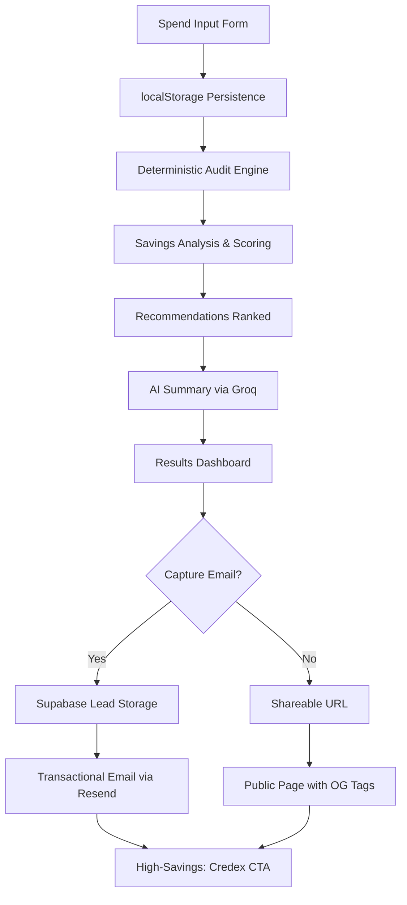

# Architecture

## Stack

**Frontend:** Next.js (App Router), TypeScript, Tailwind CSS, shadcn/ui  
**Backend:** Vercel serverless, Supabase (leads + audits), Groq API (summaries)  
**Testing:** Vitest  
**CI/CD:** GitHub Actions, Husky pre-commit  

---

## System Flow

---

## Why These Choices

**Deterministic Audit Rules (not AI):** TypeScript rules are testable, explainable, and financially defensible. Assignment emphasizes knowing when *not* to use AI.

**Groq for Summaries:** Faster inference, generous free tier. Since audit math is deterministic, we don't need expensive LLM reasoning—just readable summaries.

**App Router:** Better server/client separation, cleaner API routes, native support for dynamic pages (`/audit/[id]`).

**localStorage Persistence:** No backend sync needed for form state. We capture data *after* showing value, so single-device persistence is fine.

**Honest "Already Optimized" State:** Fake savings destroy credibility. Better to build trust for long-term Credex conversions.

---

## Scale Path

- **Serverless Vercel:** Horizontal scaling for high audit volume
- **Stateless audit engine:** No server state, instant horizontal scaling
- **Lightweight computation:** Deterministic rules are CPU-efficient
- **Database indexing:** Fast audit lookups by ID
- **Cached pricing data:** Versioned, independent of audit logic

If this hits 10k audits/day, separate pricing data into a versioned service, add caching layer (Redis), and split audit storage across Postgres shards.

---

## Production Considerations

**Abuse Protection:** Honeypot field on lead form (simple, effective for MVP traffic)  
**Rate Limiting:** Vercel's built-in + future middleware for aggressive patterns  
**Email Validation:** Resend handles bounces; Supabase tracks soft/hard failures  
**Error Handling:** Graceful fallback summaries if Groq API fails  
**Environment Variables:** All secrets in .env.local, CI uses GitHub Actions secrets