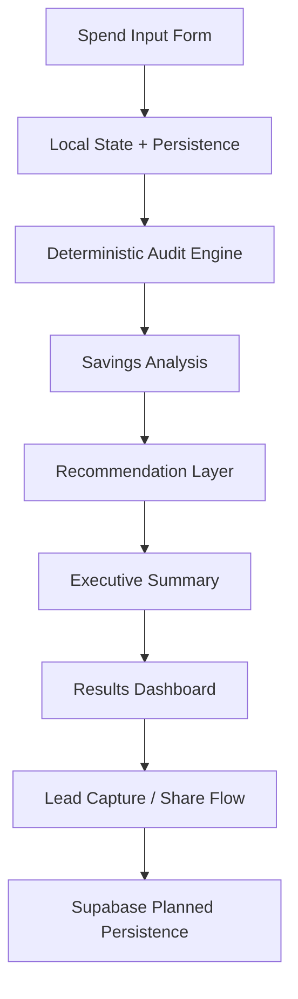

# Architecture

## Stack

### Frontend
- Next.js (App Router)
- TypeScript
- Tailwind CSS
- shadcn/ui

### Infrastructure
- Vercel deployment
- GitHub Actions CI/CD
- Husky pre-commit hooks

### Testing
- Vitest

### Planned Integrations
- Supabase (audit persistence + lead storage)
- Anthropic API (AI-generated executive summaries)

---

## System Flow

---

## Scale Considerations

The current architecture is optimized for low operational overhead and can scale horizontally for high audit volume workloads.

- serverless deployment on Vercel
- stateless audit engine
- lightweight TypeScript computation
- cached pricing data
- database indexing for audit lookups
- separation of pricing data from audit logic for independent updates

---

## Design Decisions

### Why Deterministic Audit Rules

The recommendation engine intentionally uses deterministic TypeScript rules instead of LLM-generated recommendations for the first version of the product.

Reasons:
- predictable and explainable outputs
- easier testing and debugging
- reduced hallucination risk
- simpler pricing normalization across vendors
- easier enforcement of honest recommendation states

AI-generated summaries are planned as a secondary enhancement layer rather than the primary decision engine.

- Audit logic uses deterministic TypeScript rules
- AI is used only for summaries
- Public share URLs exclude sensitive data

## Future Improvements

- organization-wide spend aggregation
- vendor overlap detection using embeddings
- shareable audit reports
- usage-based pricing normalization
- AI-generated optimization summaries
- CRM integration for enterprise lead routing