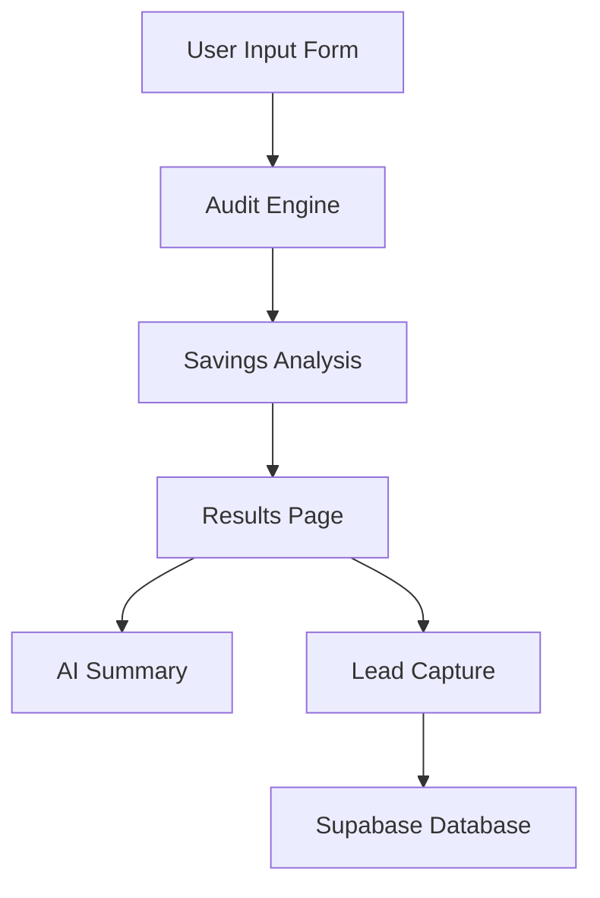

# Architecture

## Stack

- Next.js
- TypeScript
- TailwindCSS
- shadcn/ui
- Vercel
- Supabase (planned)
- Anthropic API (planned)

---

## System Flow

---

## Scale Considerations

The application is designed to scale to 10k+ audits by:

- serverless deployment on Vercel
- stateless audit engine
- lightweight TypeScript computation
- cached pricing data
- database indexing for audit lookups

---

## Design Decisions

- Audit logic uses deterministic TypeScript rules
- AI is used only for summaries
- Public share URLs exclude sensitive data