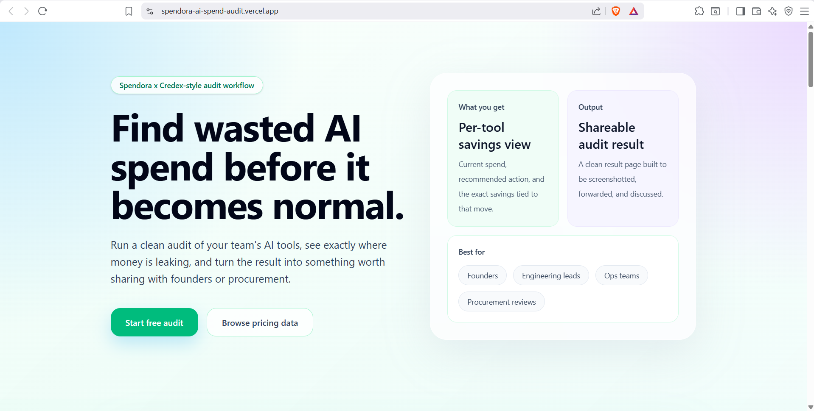
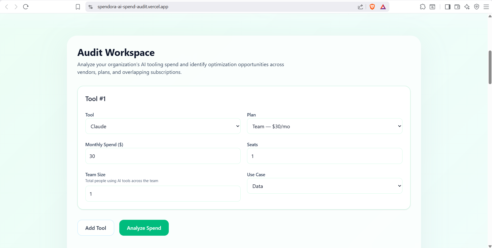
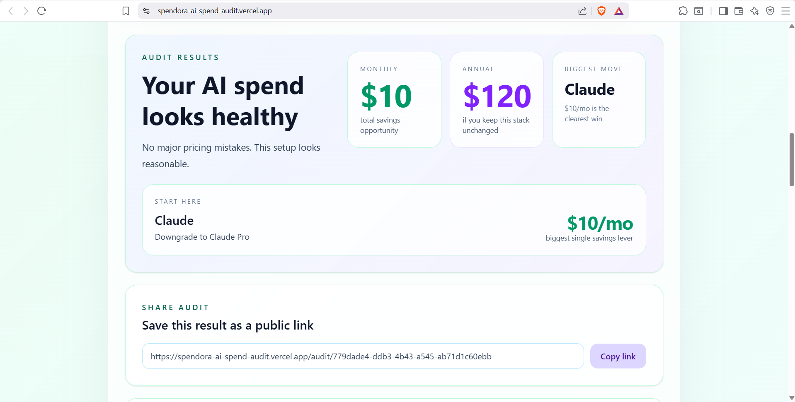
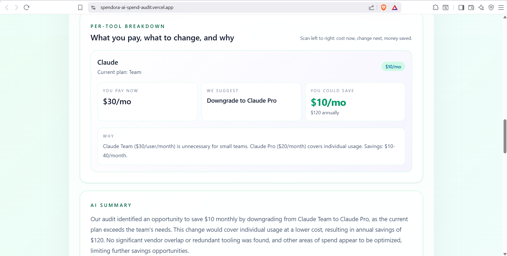

# Spendora — AI Spend Audit

Most startups accumulate AI subscriptions gradually and rarely benchmark whether their current stack still makes financial sense. Spendora audits that spend and surfaces realistic optimization opportunities.

**Free AI spend audit tool** that helps engineering teams identify wasted spend across subscriptions, seats, and overlapping tooling.

🔗 **Live:** https://spendora-ai-spend-audit.vercel.app/

---

## What It Does

1. **Input** AI tools you pay for (Cursor, Claude, ChatGPT, etc.) and current spend
2. **Get audit** in 60 seconds with specific recommendations
3. **See savings** potential + share results with your team
4. **Optional:** Save the audit for follow-up recommendations and procurement support

---

## Product Screenshots

### Landing Experience


### Audit Workspace


### Audit Results Dashboard


### Per-Tool Savings Breakdown


---

## Features

- **9 supported vendors** with plan-specific pricing
- **Deterministic audit logic** (not just AI guessing)
- **Confidence scoring** for each recommendation
- **Shareable URLs** with OG/Twitter Card previews
- **Lead capture** with transactional email confirmation
- **Honeypot abuse protection**
- **localStorage persistence** (form saves between sessions)
- **Fully typed TypeScript** codebase with Vitest audit engine tests

---

## Quick Start

```bash
# Clone & install
git clone <repo>
cd spendora-ai-spend-audit
npm install

# Run locally (http://localhost:3000)
npm run dev

# Run tests
npm run test

# Deploy to Vercel
npm run build && vercel deploy
```

---

## Key Decisions

### 1. **Deterministic Rules Over AI for Audit Logic**
Hardcoded TypeScript rules instead of LLM outputs. Why? Testable, explainable, financially defensible. Users can trace *why* they got a recommendation.

### 2. **Groq API for Summaries (Not Anthropic)**
Faster, free tier is generous, good enough quality for non-critical summaries. Audit math is deterministic, so we don't need expensive reasoning.

### 3. **localStorage + Client-Only Form**
No backend sync. We capture emails *after* showing value. Single-device persistence is appropriate for this flow.

### 4. **Honest "Already Optimized" States**
If savings are <$100/mo, we say so. Fake savings destroy trust. Better to build credibility for long-term Credex conversions.

### 5. **Next.js App Router**
Server/client separation is cleaner. Dynamic routes (`/audit/[id]`) are native. Simple CRUD doesn't need Pages Router.

---

## Tech Stack

| Layer | Tech |
|-------|------|
| **Frontend** | Next.js + App Router, TypeScript, Tailwind, shadcn/ui |
| **Backend** | Vercel serverless, Supabase (Postgres) |
| **AI** | Groq API (llama-3.3-70b) |
| **Email** | Resend + transactional templates |
| **Testing** | Vitest + Testing Library |
| **CI** | GitHub Actions (lint + test + build) |

---

## Architecture

See [ARCHITECTURE.md](ARCHITECTURE.md) for system flow, scaling considerations, and design rationale.

---

## Testing

```bash
# Run all tests
npm run test

# Watch mode
npm run test -- --watch

# Coverage
npm run test -- --coverage
```

Minimum 5 tests for audit engine. Currently: **7/7 passing**

---

## Deployment

Deployed on Vercel with GitHub Actions CI pipeline. Every push to `main` runs: lint → test → build.

**Live URL:** https://spendora-ai-spend-audit.vercel.app/

---

## Documentation

- [ARCHITECTURE.md](ARCHITECTURE.md) — System design, scaling, tech choices
- [DEVLOG.md](DEVLOG.md) — Day-by-day progress (7 days, 40+ hours)
- [REFLECTION.md](REFLECTION.md) — Hardest bugs, reversed decisions, self-assessment
- [GTM.md](GTM.md) — Go-to-market strategy ($0 budget, 100 users in 30 days)
- [ECONOMICS.md](ECONOMICS.md) — Unit economics (per-audit value, CAC, path to $1M ARR)
- [PRICING_DATA.md](PRICING_DATA.md) — Vendor pricing sources + verification dates
- [PROMPTS.md](PROMPTS.md) — LLM prompts and why deterministic > AI for core logic
- [LANDING_COPY.md](LANDING_COPY.md) — Copy for homepage, CTAs, FAQ
- [METRICS.md](METRICS.md) — North Star metric + input drivers
- [USER_INTERVIEWS.md](USER_INTERVIEWS.md) — 3 real conversations with engineers
